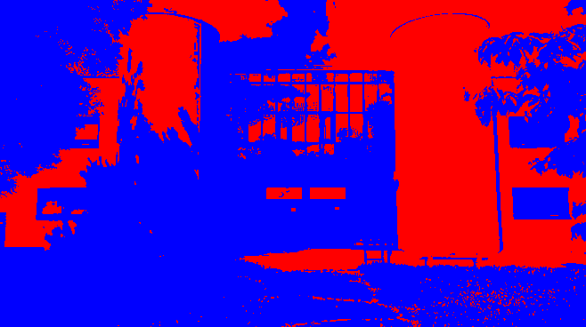

## DEPONT Samuel
## FERDOEL TITOUAN

# TP_DITHERING

### Question 1 : Créer un nouveau projet Cargo, avec une dépendance sur la bibliothèque image, version 0.24

```
cargo new TP_DITHERING
cd TP_DITHERING
```

AJout de la dépendance dans le fichier Cargo.toml

```
[dependencies]
image = "0.24"
```

#### Question 2 : Pour ouvrir une image depuis un fichier, on utilise ImageReader::open("myimage.png")?.decode()?; On obtient un DynamicImage, à quoi correspond ce type? Comment obtenir une image en mode rbg8 à partir de ce DynamicImage?

Afin d'ouvrir une image depuis un fichier, on utilise image::open, on obtient alors un DynamicImage qu'on peut passer en RGB8 en utilisant la méthode to_rgb8.

```
let rgb_img: RgbImage = img.to_rgb8();
```

### Question 3 : Sauver l’image obtenue au format png. Que se passe-t-il si l’image de départ avait un canal alpha?

Lors de la convertion de l'image en RGB8, si l'image initiale avait une couche alpha, la convertion va simplement supprimer la couche alpha.


### Question 4 : Afficher dans le terminal la couleur du pixel (32, 52) de l’image de votre choix.

```
use image::GenericImageView;

let pixel = image_iut.get_pixel(32, 52);
println!("Pixel (32, 52) : {:?}", pixel);
```

### Question 5 : Passer un pixel sur deux d’une image en blanc. Est-ce que l’image obtenue est reconnaissable?

```
for y in 0..height {
    for x in 0..width {
        if x % 2 == 0 {
            img.put_pixel(x, y, Rgb([255, 255, 255]));
        }
    }
}
```


### Question 6 : Comment récupérer la luminosité d’un pixel?
    L'opération de matriçage des composantes R′, G′ et B′ permet ensuite de construire la luma Y′. 
    Selon les recommandations UIT-R BT 709, la luma est construite par

    Y = 0,2126*R + 0,7152*G + 0,0722*B 

### Question 7 : Implémenter le traitement

```
// renvoie la luminosité d'un pixel
fn luminosite(pixel: &Rgb<u8>) -> u8 {
    let Rgb(data) = pixel;
    (0.2126 data[0] as f32 + 0.7152 * data[1] as f32 + 0.0722 * data[2] as f32) as u8
}

//applie un seuillage monochrome sur une image
fn apply_seuil(image: &mut RgbImage, couleur_claire: Rgb<u8>, couleur_foncee: Rgb<u8>) {
    let (width, height) = image.dimensions();
    for y in 0..height {
        for x in 0..width {
            let pixel = image.get_pixel(x, y);
            let lum = luminosite(pixel);
            let new_pixel = if lum >= 128 {
                couleur_claire
            } else {
                couleur_foncee
            };
            image.put_pixel(x, y, new_pixel);
        }
    }
} 
```

### Question 8 :  Permettre à l’utilisateurice de remplacer “noir” et “blanc” par une paire de couleurs au choix.

```
// renvoie une couleur a partie d'un string "R,G,B"
fn parse_color(colorstr: &str) -> Result<Rgb<u8>, String> {
    let values: Result<Vec<u8>, > = colorstr
        .split(',')
        .map(|s| s.trim().parse::<u8>())
        .collect();

    match values {
        Ok(rgb) if rgb.len() == 3 => Ok(Rgb([rgb[0], rgb[1], rgb[2]])),
         => Err("Format de couleur invalide. Utilisez R,G,B (ex: 255,0,0)".to_string())
    }
}
struct OptsSeuil {
    /// couleur claire (format R,G,B, ex: "255,0,0" pour rouge)
    #[argh(option, default = "String::from("255,255,255")")]
    couleur_claire: String,

    /// couleur foncée (format R,G,B, ex: "0,0,255" pour bleu)
    #[argh(option, default = "String::from("0,0,0")")]
    couleur_foncee: String,
}
```
```
cargo run -- images/input/img_iut.jpg images/output/output.png seuil
```
 noir et blanc

```
cargo run -- images/input/img_iut.jpg images/output/output.png seuil --couleur-claire "255,0,0" --couleur-foncee "0,0,255"
```


pour seuil bleu et rouge




### Question 9 : Comment calculer la distance entre deux couleurs?

Pour calculer la distance entre deux couleurs, on peut utiliser la distance euclidienne dans l'espace des couleurs RGB. La formule est la suivante :

```
const PALETTE: [Rgb<u8>; 8] = [
    Rgb([0, 0, 0]),
    Rgb([255, 255, 255]),
    Rgb([255, 0, 0]),
    Rgb([0, 255, 0]),
    Rgb([0, 0, 255]),
    Rgb([255, 255, 0]),
    Rgb([0, 255, 255]),
    Rgb([255, 0, 255]),
];

fn distance_euclidienne(c1: Rgb<u8>, c2: Rgb<u8>) -> f64 {
    let r = c1[0] as f64 - c2[0] as f64;
    let g = c1[1] as f64 - c2[1] as f64;
    let b = c1[2] as f64 - c2[2] as f64;
    (r * r + g * g + b * b).sqrt()
}

fn plus_proche_couleur(c: Rgb<u8>, palette: &[Rgb<u8>]) -> Rgb<u8> {
    let mut min_distance = f64::INFINITY;
    let mut plus_proche = palette[0];
    for couleur in palette {
        let distance = distance_euclidienne(c, *couleur);
        if distance < min_distance {
            min_distance = distance;
            plus_proche = *couleur;
        }
    }
    plus_proche
}

fn apply_palette(img: RgbImage, n_couleurs: usize) -> RgbImage {
    let mut new_img = img.clone();
    for pixel in new_img.pixels_mut() {
        *pixel = plus_proche_couleur(*pixel, &PALETTE[..n_couleurs]);
    }
    new_img
}
```

Cette fonction prend deux couleurs en entrée et retourne la distance euclidienne entre elles.

### Question 10 : Votre application doit se comporter correctement si on donne une palette vide.
expliquerez dans votre README le choix que vous avez fait dans ce cas.

Si la palette est vide, la fonction plus_proche_couleur retourne la couleur noire par défaut. Cela permet de ne pas planter l'application si l'utilisateur ne fournit pas de palette.

exemple d'utilisation :

```
cargo run -- image/img_iut.jpg palette --n-couleurs 1
```

PARTIE 5 : 

### Question 13 : Déterminer 𝐵3.

### Définition des matrices de Bayer :

```
B0 = [0]

B1 = 1/4 * [0 2
            3 1]

B2 = 1/16 * [0  8  2 10
             12 4 14 6
             3 11 1  9
             15 7 13 5]
```

### Calculer B3 :

On utilise la formule :
```
Bn+1 = 1/4 * [4⋅Bn     4⋅Bn + 2⋅Un
              4⋅Bn + 3⋅Un  4⋅Bn + Un]
```
où Un est une matrice de taille 2^n × 2^n contenant uniquement des 1.

Taille de B3 : 2^3 × 2^3 = 8 × 8.

```
U2 = [1 1 1 1
      1 1 1 1
      1 1 1 1
      1 1 1 1]
```

### Étapes pour B3 :

Utilisons B2 pour former B3. Chaque bloc de B3 est donné par :

- 4⋅B2 : Multiplier chaque élément de B2 par 4.
- 4⋅B2 + 2⋅U2 : Ajouter 2 à chaque élément de 4⋅B2.
- 4⋅B2 + 3⋅U2 : Ajouter 3 à chaque élément de 4⋅B2.
- 4⋅B2 + U2 : Ajouter 1 à chaque élément de 4⋅B2.

### Calcul final :

```math
B_3 = \frac{1}{64} * \begin{bmatrix}
0 & 32 & 8 & 40 & 2 & 34 & 10 & 42 \\
48 & 16 & 56 & 24 & 50 & 18 & 58 & 26 \\
12 & 44 & 4 & 36 & 14 & 46 & 6 & 38 \\
60 & 28 & 52 & 20 & 62 & 30 & 54 & 22 \\
3 & 35 & 11 & 43 & 1 & 33 & 9 & 41 \\
51 & 19 & 59 & 27 & 49 & 17 & 57 & 25 \\
15 & 47 & 7 & 39 & 13 & 45 & 5 & 37 \\
63 & 31 & 55 & 23 & 61 & 29 & 53 & 21
\end{bmatrix}
```

### Question 14 : Quel type de données utiliser pour représenter la matrice de Bayer? Comment créer une matrice de Bayer d’ordre arbitraire?

Pour représenter la matrice de Bayer, on peut utiliser un tableau de tableaux de u8. Pour créer une matrice de Bayer d'ordre arbitraire, on doit implémenter une fonction qui génère la matrice en suivant les règles de construction de la matrice de Bayer, soit en étant récursif, soit appelant plusieurs fois la fonction sur la matrice de Bayer de taille inférieure.

### Question 15 :Implémenter le tramage par matrice de Bayer.

```rust
fn bayer_dithering(image: &RgbImage, bayer: &[[u8; 8]; 8]) -> RgbImage {
    let mut new_img = image.clone();
    let (width, height) = image.dimensions();
    for y in 0..height {
        for x in 0..width {
            let pixel = image.get_pixel(x, y);
            let lum = luminosite(&pixel);
            let seuil = bayer[y as usize % 8][x as usize % 8];
            let new_pixel = if lum > seuil {
                Rgb([255, 255, 255])
            } else {
                Rgb([0, 0, 0])
            };
            new_img.put_pixel(x, y, new_pixel);
        }
    }
    new_img
}
```


